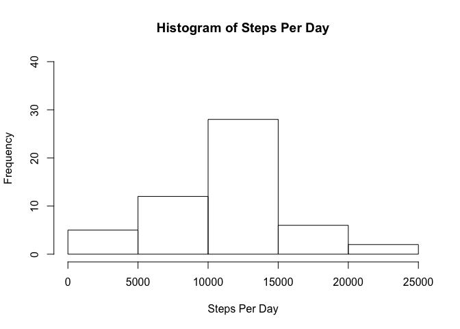
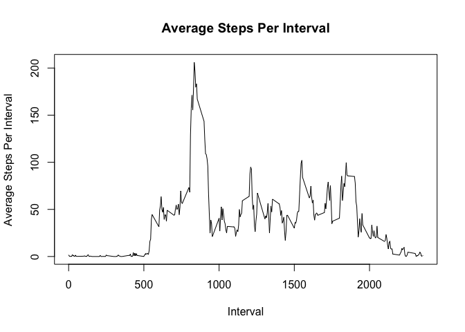
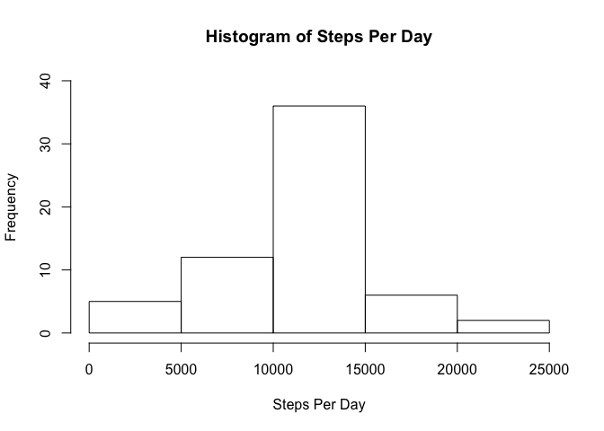
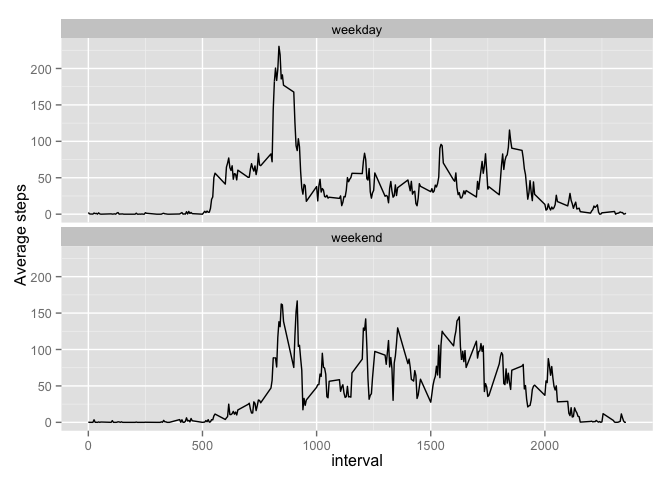

# Reproducible Research: Peer Assessment 1

This document is made for the course Reproducible Research.

## Loading and preprocessing the data


**1. Load all the libraries used in this assignment (dplyr, ggplot2)**


```r
library(dplyr)
library(ggplot2)
```

**2. Check whether the activity data is available and download/unzip the data set if this is not the case**


```r
if(!file.exists("activity.csv")){
    if(!file.exists("activity.zip")){
        download.file("https://d396qusza40orc.cloudfront.net/repdata%2Fdata%2Factivity.zip", "activity.zip", method="curl")
    }
    unzip("activity.zip")
}
```

**3. Load the data from activity.csv**


```r
data <- read.csv("activity.csv")
```

**4. Change the date column data into Date-format**


```r
data$date <- as.Date(data$date)
```

## What is mean total number of steps taken per day?

**1. Calculate the total number of steps taken per day**

```r
data_group_day <- group_by(filter(data, !is.na(steps)), date)
steps_per_day <- summarise(data_group_day, Steps_per_day = sum(steps))
```

**2. Make a histogram of the total number of steps taken each day**

```r
hist(steps_per_day$Steps_per_day, main = "Histogram of Steps Per Day", xlab = "Steps Per Day", ylim=c(0,40))
```

 


**3. Calculate and report the mean and median of the total number of steps taken per day**


```r
mean(steps_per_day$Steps_per_day)
```

```
## [1] 10766.19
```

```r
median(steps_per_day$Steps_per_day)
```

```
## [1] 10765
```


## What is the average daily activity pattern?

**1. Make a time series plot (i.e. type = "l") of the 5-minute interval (x-axis) and the average number of steps taken, averaged across all days (y-axis)**


```r
data_group_interval <- group_by(filter(data, !is.na(steps)), interval)
average_steps_per_interval <- summarise(data_group_interval, Average_steps = mean(steps))
plot(average_steps_per_interval$interval, average_steps_per_interval$Average_steps, type = "l", main = "Average Steps Per Interval", xlab="Interval", ylab = "Average Steps Per Interval")
```

 

**2. Which 5-minute interval, on average across all the days in the dataset, contains the maximum number of steps?**


```r
filter(average_steps_per_interval, Average_steps == max(Average_steps))
```

```
## Source: local data frame [1 x 2]
## 
##   interval Average_steps
## 1      835      206.1698
```


## Imputing missing values

**1. Calculate and report the total number of missing values in the dataset (i.e. the total number of rows with NAs)**


```r
sum(is.na(data$steps))
```

```
## [1] 2304
```


**2. & 3. Fill in all of the missing values in the dataset by using the  mean for that 5-minute interval. Create a new dataset that is equal to the original dataset but with the missing data filled in.**

The strategy used is to fill the NA values with the mean values for that particular 5 minute interval. The new data set called data_filled is created.


```r
data_filled <- data
for(i in 1:nrow(data_filled)){
    if(is.na(data_filled[[1]][[i]])){
        inter <- data_filled[[3]][[i]]
        ave <- filter(average_steps_per_interval, interval == inter)
        data_filled[[1]][[i]] <- ave[[2]]
    }
}
```


**4.1  Make a histogram of the total number of steps taken each day.** 


```r
data_group_day <- group_by(data_filled, date)
steps_per_day <- summarise(data_group_day, Steps_per_day = sum(steps))
hist(steps_per_day$Steps_per_day, main = "Histogram of Steps Per Day", xlab = "Steps Per Day", ylim=c(0,40))
```

 

**4.2 Calculate and report the mean and median total number of steps taken per day.**


```r
mean(steps_per_day$Steps_per_day)
```

```
## [1] 10766.19
```

```r
median(steps_per_day$Steps_per_day)
```

```
## [1] 10766.19
```


**4.3 Do these values differ from the estimates from the first part of the assignment?** 

The mean is the same as previous, but the median has changed to be equal with mean.

**4.4 What is the impact of imputing missing data on the estimates of the total daily number of steps?**

There is no impact to mean steps taken, and minimal impact to median steps taken. This is mainly because the na-filling strategy was based on interval means.


## Are there differences in activity patterns between weekdays and weekends?

**1. Create a new factor variable in the dataset with two levels – “weekday” and “weekend” indicating whether a given date is a weekday or weekend day.**


```r
data_filled_m <- mutate(data_filled, Weekday = weekdays(date), Weekday_Weekend= ifelse((Weekday == "Sunday" | Weekday == "Saturday"), "weekend", "weekday"))
```

**2. Make a panel plot containing a time series plot of the 5-minute interval (x-axis) and the average number of steps taken, averaged across all weekday days or weekend days (y-axis).**


```r
data_grouped <- group_by(data_filled_m, interval, Weekday_Weekend)
average_steps_per_interval <- summarise(data_grouped, Average_steps = mean(steps))
ggplot(average_steps_per_interval, aes(x=interval, y=Average_steps)) + 
    geom_line() + 
    facet_wrap(~ Weekday_Weekend, ncol=1) + 
    ylab("Average steps")
```

 

**ANSWER:** There are visible differences between the weekday and weekend average total step patterns per interval. On weekdays, for example, the high peak of "going to work" -steps is clearly visible, where as on weekends there is no such peak (as people don't in general go to work in the morning).
